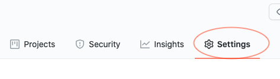
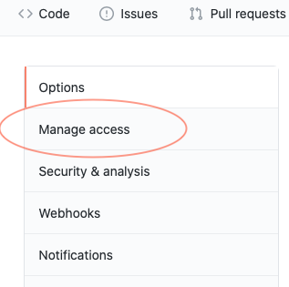
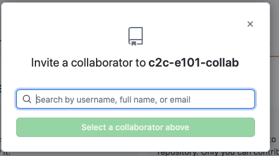
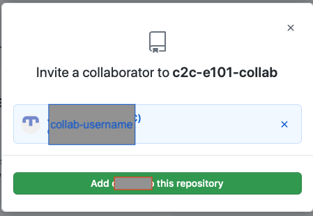
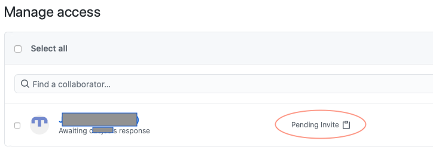
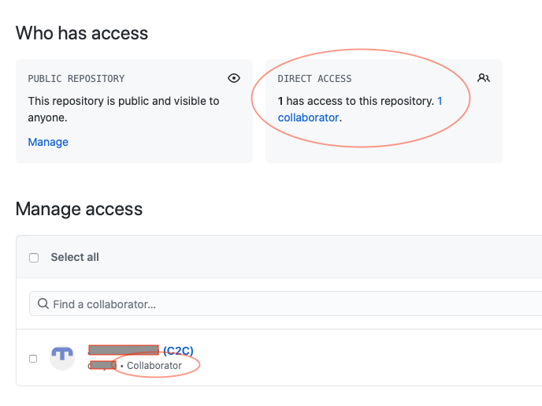

Adding a Collaborator to your GitHub repository
===============================================

Follow these steps to add a collaborator to your repository.

## Go to the "Settings" for your repository

## Select "Manage Access"

## Invite a Collaborator

## Enter the GitHub User name

Type in the user name of the person you want to invite as a collaborator.
As you type the name, a list will be auto-populated. Once you type in enough
of the name, you can click the user name in the list.

## Add the Collaborator

Once you find the name of the person your want to add as the Collaborator,
click "Add (username) to this repository"

## Verify collaborator is pending

## Collaborator Accepts the Invitation

The collaborator will receive an email and can accept the invitation with a
link in the email.

OR, from the collaborator account, navigate to the repository page, with
`invitations` added to the URL. It will look like this:

    https://github.com/OWNERNAME/REPONAME/invitations

From here, accept the invitation to collaborate

## Verify the Collaborator is Added

Go back to the "Manage Access" page and you should be able to see that the
collaborator has been added.

