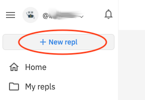
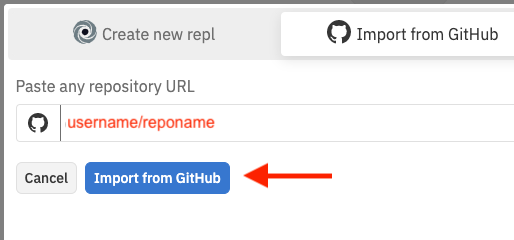
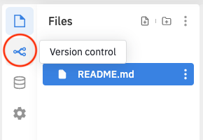
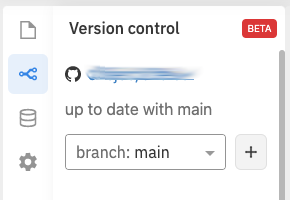

Import a GitHub Project into repl.it
====================================

These steps assume you have already connected your repl.it account to your
GitHub account.

## New Project

In [repl.it](https://repl.it) click the button to create a new project.

## Import From GitHub

From the "New Project" pane, click the "Import From GitHub" tab.

Enter the GitHub repo URL or type in the username and repo name. Then click
"Import from GitHub".

## View Files and Version Info

After the import, in the left pane you should see the project files from the
GitHub project.

Click the "version control" icon.

You should see the GitHub project name, and it should show you up to date
with the main branch.

